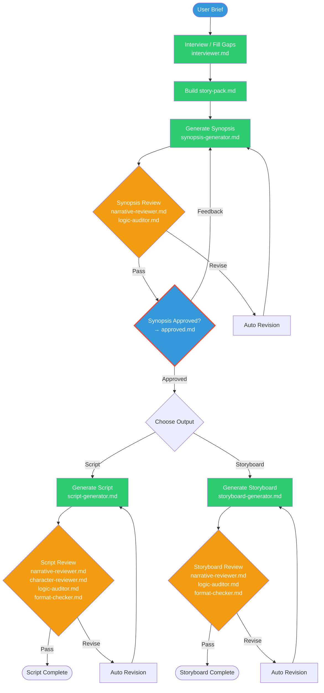
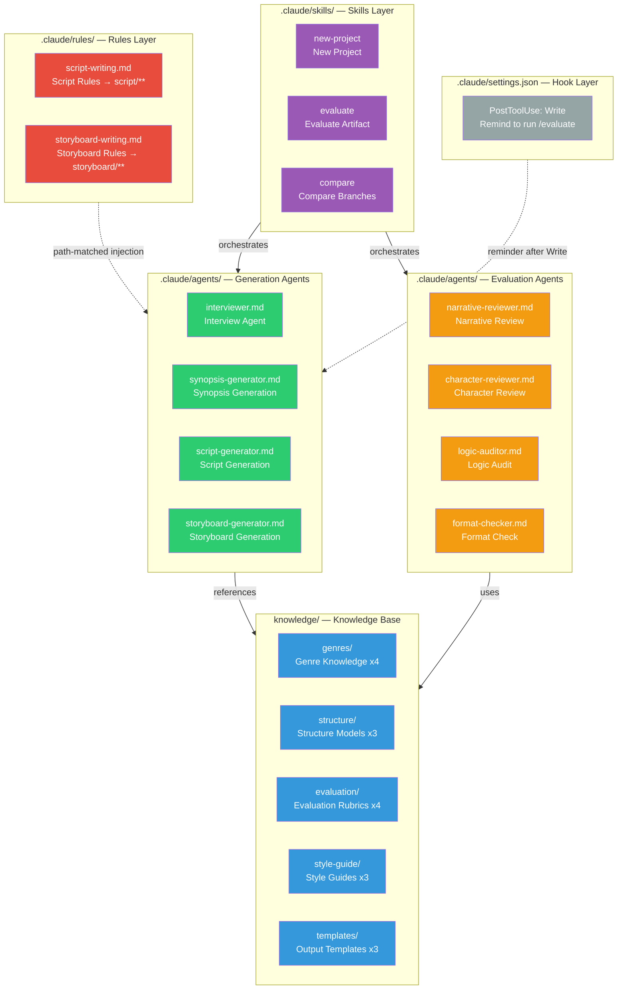
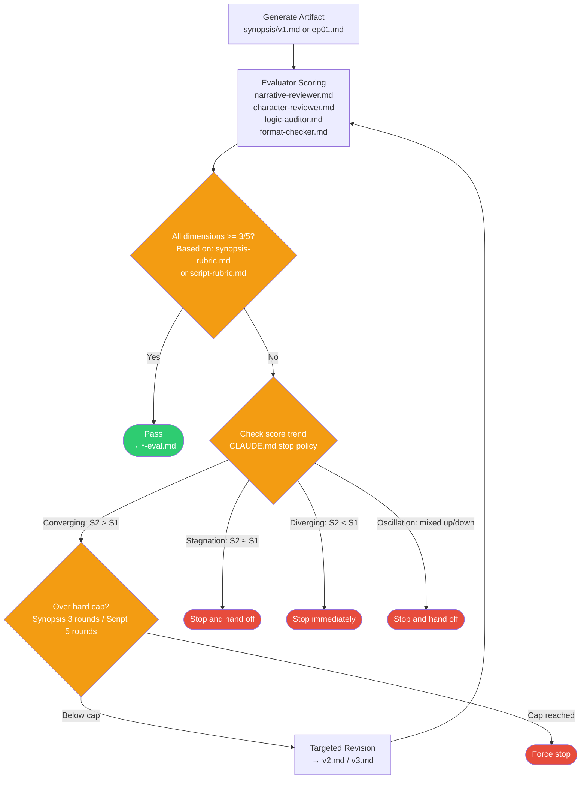

  <a href="./README.md">简体中文</a>

<h1 align="center">StoryForge</h1>

  A Claude Code-based story generation Agent Runtime for computation under uncertainty

  
  
  
  
  
  

## Overview

StoryForge is an independent open-source Agent Runtime built on top of Claude Code. It uses short-drama creation as the validation scenario, but the real subject of the project is not “generate a script.” The goal is to turn open-ended, generative, non-unique, human-judged work into a runtime that is controllable, auditable, and capable of convergence-aware iteration.

This repository should be read as a standalone runtime project. The tracked structure, rules, evaluations, and examples define the public project. Ignored local notes, drafts, and private design materials are intentionally outside the public runtime.

## Quick Positioning

| Dimension | Description |
| --- | --- |
| Project type | Claude Code-based Agent Runtime |
| Core thesis | Harness Engineering for computation under uncertainty |
| Demonstration scenario | Synopsis, script, and storyboard workflows |
| Key mechanisms | Context assembly, hard gates, role isolation, review loops, convergence stops, audit trails |
| Execution model | Claude Code + Markdown-native repo structure |

## Why Harness Engineering for Computation Under Uncertainty

Many Harness Engineering discussions focus on deterministic computation: compiling, testing, tool orchestration, data transformation, and rule-based validation. Those tasks usually have stable I/O, clearer correctness, and near-binary pass/fail conditions.

StoryForge is aimed at a different class of work: computation under uncertainty.

- The output is not a single correct answer but a set of plausible candidates.
- Quality is judged through rubrics, reviewer agents, and human approval rather than one assertion.
- Revision does not guarantee monotonic improvement; it can stall, diverge, or oscillate.
- Human approval is not an afterthought but a first-class runtime control point.
- Audit trails are not optional metadata but part of safe handoff and replay.

So the harness here does not treat the model as a black-box function call. It treats generation, review, revision, stop conditions, and archiving as runtime primitives.

## System Diagrams

The three diagrams below are reused from the project's internal system design set. Together they show StoryForge from three complementary angles: end-to-end flow, runtime architecture, and the evaluation/revision loop.

### Diagram 1: Main Flow

This diagram shows the path from a raw idea to a final output such as a script or storyboard. The red gate marks the mandatory human approval point.

### Diagram 2: Runtime Architecture

This view emphasizes the runtime layers: Skills orchestrate, Agents execute, Knowledge supports, Rules inject constraints, and Hooks provide reminders after tool events.

### Diagram 3: Evaluation and Auto-Revision Loop

This view focuses on what happens after generation. The runtime scores artifacts, detects convergence or stagnation, and stops rather than revising forever.

## This Is Not a One-Click Generator

The project is not about writing a longer prompt. It is about making the runtime control structure explicit.

- `synopsis/approved.md` is a hard gate; no approved synopsis means no script or storyboard generation
- generator and evaluator agents operate under separated contexts
- synopsis and script loops have bounded revision budgets and convergence-aware stop conditions
- every major action is logged into `changelog.md`
- artifacts and evaluation reports stay inside the project directory for replay and takeover

## Why Claude Code Runtime Matters

StoryForge is not a conventional web app and not a standalone backend service. Its assumed runtime host is Claude Code.

In that model:

- [CLAUDE.md](./CLAUDE.md) defines global workflow constraints and hard gates
- [`.claude/skills/`](./.claude/skills) exposes structured entry points such as `/new-project`, `/evaluate`, and `/compare`
- [`.claude/agents/`](./.claude/agents) defines generation and review roles
- [`.claude/rules/`](./.claude/rules) injects domain constraints through path matching
- `projects/*` acts as transparent runtime state and artifact storage

Put simply, Claude Code is both the agent host and the operating interface for this runtime.

## Core Components

| Component | Role | Path |
| --- | --- | --- |
| Skills | High-level workflow entry points | [`.claude/skills/`](./.claude/skills) |
| Agents | Generation, review, and audit roles | [`.claude/agents/`](./.claude/agents) |
| Rules | Hard constraints injected by path | [`.claude/rules/`](./.claude/rules) |
| Knowledge | Genre, structure, template, and rubric references | [`knowledge/`](./knowledge) |
| Projects | Runtime state, intermediate artifacts, final outputs | [`projects/`](./projects) |
| Evals | Evaluation cases, baselines, and regression runs | [`evals/`](./evals) |

## Current Capabilities

- interview and normalize a creative brief into `story-pack.md`
- generate a synopsis before any downstream output
- branch into script or storyboard generation after approval
- run rubric-based review with independent evaluator agents
- revise with convergence-aware stopping logic
- preserve changelogs, eval reports, and project artifacts in Markdown

## Repository Status

Based on [`evals/baseline.md`](./evals/baseline.md):

- 8 agent definitions completed
- 3 skills integrated
- 18 knowledge files loaded into runtime context
- 6/6 evaluation cases passing

You can inspect example projects directly:

- [`projects/false-memory/`](./projects/false-memory)
- [`projects/eval-revenge-drama/`](./projects/eval-revenge-drama)

## Quick Start

1. Clone the repository and open it in Claude Code.
2. Use `/new-project` with a creative brief.
3. Review the generated `story-pack.md` and `synopsis/v1.md`.
4. Run `/evaluate` on artifacts and inspect the revision loop.
5. Approve the synopsis before continuing to script or storyboard generation.

## Who This Is For

- developers exploring Claude Code as a multi-agent runtime host
- teams building controllable workflows for content generation
- researchers interested in Harness Engineering for computation under uncertainty
- anyone who wants a Markdown-native, auditable, replayable Agent project example
