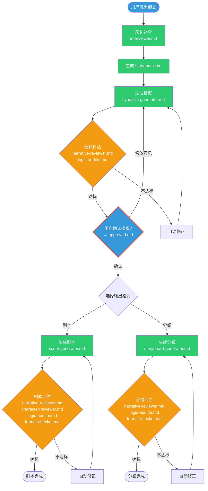
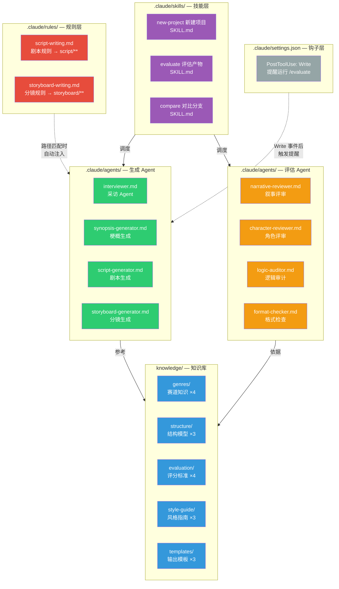
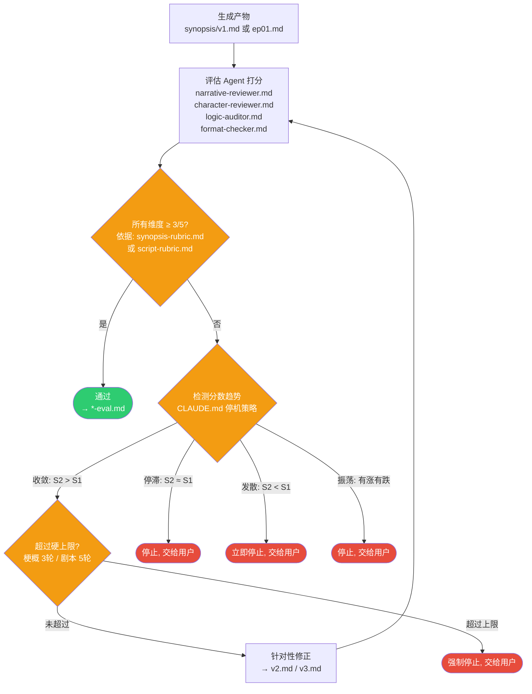

  <a href="./README.en.md">English</a>

<h1 align="center">StoryForge</h1>

  基于 Claude Code 的故事生成 Agent Runtime，用 Harness Engineering 处理不确定性下的计算

  
  
  
  
  
  

## 项目简介

StoryForge 是一个独立的开源 Agent Runtime。它基于 Claude Code 构建，使用短剧创作作为验证场景，但项目的真正目标不是“生成一段内容”，而是把生成式、开放式、质量非唯一、需要人工判断的任务，组织成一个可控、可审计、可收敛的运行时系统。

这个仓库应该被理解为一个 standalone runtime project。公开仓库中的结构、规则、评估与示例，均以项目自身定义为准；本地忽略的私有笔记、草稿和设计材料不属于公开 runtime 的一部分。

## 快速定位

| 维度 | 说明 |
| --- | --- |
| 项目类型 | 基于 Claude Code 的 Agent Runtime |
| 核心命题 | 用 Harness Engineering 处理不确定性下的计算 |
| 演示场景 | 短剧梗概、剧本、分镜工作流 |
| 关键机制 | 上下文组装、硬卡点、角色隔离、评估回路、收敛停止、留痕归档 |
| 运行载体 | Claude Code + Markdown-native repo structure |

## 为什么是“不确定性下的计算”的 Harness Engineering

很多 Harness Engineering 的经典问题，更多出现在确定性计算里，比如编译、测试、工具编排、数据处理、固定规则检查。这些任务通常有稳定输入输出、明确的正确结果，以及接近二元的成功判定。

StoryForge 关注的是另一类问题: 不确定性下的计算。

- 输出不是唯一正确答案，而是多个可能成立的候选版本
- 质量判断依赖 rubric、评审 Agent 和人工确认，而不是单个断言
- 修正过程不保证单调提升，可能出现停滞、发散或振荡
- 人工审批不是补丁，而是 runtime 中的一级控制点
- 过程留痕不是附加功能，而是后续接管、复核和复盘的基础设施

因此，StoryForge 的 Harness Engineering 不是把模型当成一个黑箱函数调用，而是把生成、评估、修正、停机和归档一起纳入运行时设计。

## 系统图示

下面这三张图直接复用项目内部的系统图，从三个不同角度看 StoryForge：主流程、系统架构、评估与自动修正循环。

### 图 1：主流程图

从用户的一个想法到最终产出（剧本或分镜），中间经过采访、梗概、确认、评估等环节。红色节点是硬卡点，必须用户确认才能往下走。

### 图 2：系统架构图

系统由五层组件构成。Skill 编排流程，Agent 执行任务，Knowledge 提供参考，Rules 按路径自动注入硬约束，Hook 在工具事件后触发提醒。

### 图 3：评估与自动修正循环

评估不达标时，系统自动修正并重新评估。但不会无限循环，而是通过检测分数趋势和硬上限来决定何时停止。评估由 `/evaluate` 调度。

## 这不是一个“一键生成器”

StoryForge 的设计重点不是把 prompt 堆得更长，而是把 runtime 的控制结构做清楚。

- `synopsis/approved.md` 是硬卡点，没有已确认梗概时，剧本和分镜必须拒绝生成
- 生成 Agent 和评估 Agent 使用不同上下文，避免“自己写自己评”
- 梗概和剧本分别有修正上限，并根据收敛、停滞、发散、振荡来决定是否继续
- 所有关键动作都要写入 `changelog.md`
- 最终产物和评估报告都保留在项目目录中，便于回看和接管

## 为什么强调 Claude Code Runtime

StoryForge 不是一个传统意义上的 Web 应用，也不是独立部署的后端服务。它的运行时假设是 Claude Code。

在这个模型里:

- [CLAUDE.md](./CLAUDE.md) 提供全局工作流约束和硬卡点
- [`.claude/skills/`](./.claude/skills) 暴露结构化操作入口，例如 `/new-project`、`/evaluate`、`/compare`
- [`.claude/agents/`](./.claude/agents) 定义生成与评估角色
- [`.claude/rules/`](./.claude/rules) 通过路径匹配注入领域规则
- `projects/*` 目录承担透明的运行时状态与产物存储

换句话说，Claude Code 既是 agent host，也是这个 runtime 的操作界面。

## 核心组件

| 组件 | 作用 | 路径 |
| --- | --- | --- |
| Skills | 封装高层流程入口 | [`.claude/skills/`](./.claude/skills) |
| Agents | 负责生成、评估、审计等角色任务 | [`.claude/agents/`](./.claude/agents) |
| Rules | 在指定路径下注入刚性约束 | [`.claude/rules/`](./.claude/rules) |
| Knowledge | 提供赛道、结构、模板、rubric 等知识 | [`knowledge/`](./knowledge) |
| Projects | 保存项目运行状态、中间件产物与最终产物 | [`projects/`](./projects) |
| Evals | 保存评测用例、基线与回归结果 | [`evals/`](./evals) |

## 当前能力

- 采访补全创意输入并整理为 `story-pack.md`
- 先生成梗概，再进入人工确认
- 按分支生成剧本或分镜
- 用独立评估 Agent 对产物做 rubric-based review
- 根据分数趋势执行自动修正与停止策略
- 用 Markdown 留下 changelog、评估报告和项目产物

## 仓库状态

基于 [`evals/baseline.md`](./evals/baseline.md) 的当前基线:

- 8 个 Agent 定义完整
- 3 个 Skills 已接入
- 18 个知识文件已纳入运行时参考
- 6/6 评测用例通过

示例项目可直接查看:

- [`projects/false-memory/`](./projects/false-memory)
- [`projects/eval-revenge-drama/`](./projects/eval-revenge-drama)

## 快速开始

1. 克隆仓库并在 Claude Code 中打开。
2. 使用 `/new-project` 初始化一个新项目，输入你的创意 brief。
3. 查看生成的 `story-pack.md` 和 `synopsis/v1.md`。
4. 对产物运行 `/evaluate`，观察评估报告和修正回路。
5. 确认梗概后，再继续生成剧本或分镜。

## 适合谁

- 想研究 Claude Code 如何承载多 Agent Runtime 的开发者
- 想把内容生成任务做成有控制点工作流的人
- 对 Harness Engineering 如何处理不确定性下的计算感兴趣的人
- 想看一个 Markdown-native、可审计、可回放的 Agent 项目样例的人
